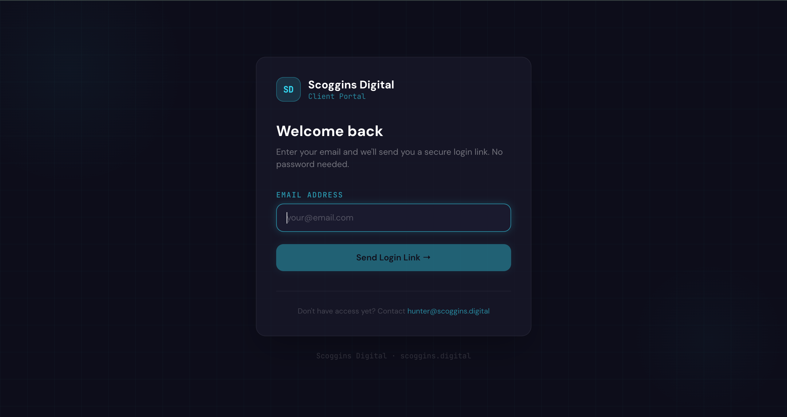

# Scoggins Digital — Client Portal

<div align="center">



**A production-ready client portal for [Scoggins Digital](https://scoggins.digital)**

Built with React, Supabase, and Tailwind CSS · Deployed at [portal.scoggins.digital](https://portal.scoggins.digital)

[](https://portal.scoggins.digital)
[](https://vitejs.dev)
[](https://supabase.com)
[](https://vercel.com)

</div>

---

## Overview

The Scoggins Digital Client Portal eliminates the friction of managing web projects over email and spreadsheets. Every client gets a private, branded workspace from day one — a single place to track progress, upload brand assets, and communicate directly with the studio.

**For clients** — A clean, minimal dashboard showing exactly where their project stands: what's done, what's next, which files are needed, and a direct line to the studio.

**For the admin (studio owner)** — A full control panel to manage every client and project from one place. Invite new clients, track milestones, manage payments, review uploaded assets, and respond to feedback threads — all without leaving the portal.

---

## Screenshots

### Login Page

The portal uses passwordless magic link authentication — no password required.


> **Live:** [portal.scoggins.digital/login](https://portal.scoggins.digital/login)

---

## Features

### Client Portal

- **Project Dashboard** — At-a-glance view of project status, progress percentage, estimated launch date, and a personal to-do checklist
- **Milestone Timeline** — Visual step-by-step timeline of every project checkpoint with completion timestamps
- **Asset Upload** — Upload logos, photos, and documents directly in the portal; add YouTube video links for the hero section
- **Feedback & Messaging** — Real-time threaded messaging between client and studio with live updates via WebSocket — no page refresh needed
- **Passwordless Login** — Magic link authentication via email — no password ever required

### Admin Panel

- **Client Overview** — Summary of all active and past projects with live status badges, progress bars, and total revenue
- **Stats Dashboard** — Total projects, active builds, and cumulative revenue at a glance
- **New Client Onboarding** — Single form to add a new client: automatically sends a branded magic link invite, creates their profile, initializes the project, and pre-populates 9 default milestones
- **Project Detail Panel** — Slide-out panel with four management tabs:
  - **Overview** — Edit project status, progress %, payment flags, kickoff and completion dates
  - **Milestones** — Toggle individual milestone completion with automatic timestamps
  - **Assets** — View and download every file the client has uploaded
  - **Feedback** — Full message thread with admin reply capability

### Security & Reliability

- **Row-Level Security (RLS)** — Supabase enforces per-user data access at the database level; clients can only ever see their own data
- **Role-Based Routing** — Admin and client roles are stored in the `profiles` table and enforced at every route
- **Service Role Separation** — Admin operations (auth invites, profile creation) use a privileged service role key that is never exposed to client sessions
- **Resilient Profile Loading** — Auto-retries profile fetch up to 3 times with 2-second delays to handle Supabase free-tier cold starts
- **Cross-Tab Auth Stability** — `loadedUserIdRef` prevents the cross-tab `SIGNED_IN` broadcast from re-triggering profile loads and disrupting active sessions
- **Real-Time Feedback** — Supabase Realtime channel subscriptions push new messages to both parties instantly

---

## Tech Stack

| Layer               | Technology                                           |
| ------------------- | ---------------------------------------------------- |
| Framework           | React 18                                             |
| Build Tool          | Vite 4.4                                             |
| Routing             | React Router DOM v6                                  |
| Styling             | Tailwind CSS v3                                      |
| Backend / Database  | Supabase (PostgreSQL)                                |
| Authentication      | Supabase Auth — Magic Link / OTP                     |
| File Storage        | Supabase Storage (`client-assets` bucket, public)    |
| Transactional Email | Resend (SMTP via `scoggins.digital` verified domain) |
| Real-Time           | Supabase Realtime (WebSockets)                       |
| Hosting             | Vercel                                               |
| Fonts               | DM Sans, JetBrains Mono (Google Fonts)               |

---

## Project Structure

```
Scoggins-Digital-Client-Portal/
├── public/
├── src/
│   ├── lib/
│   │   └── supabase.js          # All DB queries, two Supabase clients (anon + service role)
│   ├── hooks/
│   │   └── useAuth.jsx          # Auth context: session, profile, retry logic, event listeners
│   ├── components/
│   │   └── UI.jsx               # Shared components: StatusBadge, ProgressBar, Modal, Logo, etc.
│   ├── pages/
│   │   ├── LoginPage.jsx        # Magic link request form
│   │   ├── AuthCallback.jsx     # Magic link token exchange + cross-tab redirect handler
│   │   ├── ClientDashboard.jsx  # Client portal (Dashboard, Assets, Feedback, Timeline tabs)
│   │   └── AdminDashboard.jsx   # Admin panel (All Clients, New Client, Project Detail)
│   ├── App.jsx                  # Routes, ProtectedRoute, RootRedirect, LoginPageWrapper
│   ├── main.jsx                 # React entry point
│   └── index.css                # Global styles, Tailwind directives, CSS design tokens
├── vercel.json                  # SPA rewrite rule for React Router
├── vite.config.js
├── tailwind.config.js
├── .env                         # Environment variables (never committed)
└── .gitignore
```

---

## Database Schema

Five tables, all protected by Row-Level Security policies.

### `profiles`

| Column          | Type        | Description                |
| --------------- | ----------- | -------------------------- |
| `id`            | uuid        | References `auth.users.id` |
| `email`         | text        | User email                 |
| `first_name`    | text        | First name                 |
| `last_name`     | text        | Last name                  |
| `business_name` | text        | Client's business name     |
| `role`          | text        | `admin` or `client`        |
| `created_at`    | timestamptz | Account creation time      |

### `projects`

| Column                   | Type    | Description                   |
| ------------------------ | ------- | ----------------------------- |
| `id`                     | uuid    | Primary key                   |
| `client_id`              | uuid    | References `profiles.id`      |
| `name`                   | text    | Project name                  |
| `project_type`           | text    | e.g. "Small Business Website" |
| `status`                 | text    | Current workflow stage        |
| `progress`               | integer | Completion % (0–100)          |
| `total_price`            | numeric | Project price                 |
| `deposit_received`       | boolean | Deposit paid flag             |
| `final_payment_received` | boolean | Final payment flag            |
| `kickoff_date`           | date    | Project start date            |
| `est_completion`         | date    | Estimated launch date         |

### `milestones`

| Column         | Type        | Description              |
| -------------- | ----------- | ------------------------ |
| `id`           | uuid        | Primary key              |
| `project_id`   | uuid        | References `projects.id` |
| `label`        | text        | Milestone name           |
| `completed`    | boolean     | Done status              |
| `completed_at` | timestamptz | Completion timestamp     |
| `sort_order`   | integer     | Display order            |

### `assets`

| Column       | Type        | Description                          |
| ------------ | ----------- | ------------------------------------ |
| `id`         | uuid        | Primary key                          |
| `project_id` | uuid        | References `projects.id`             |
| `type`       | text        | `logo`, `photos`, `video_url`, `doc` |
| `name`       | text        | File name or label                   |
| `url`        | text        | Public URL or video link             |
| `size_bytes` | bigint      | File size (null for URLs)            |
| `created_at` | timestamptz | Upload time                          |

### `feedback`

| Column       | Type        | Description                       |
| ------------ | ----------- | --------------------------------- |
| `id`         | uuid        | Primary key                       |
| `project_id` | uuid        | References `projects.id`          |
| `message`    | text        | Message content                   |
| `from_admin` | boolean     | `true` = studio, `false` = client |
| `created_at` | timestamptz | Send time                         |

### Project Status Workflow

```
awaiting_contract → awaiting_deposit → awaiting_assets →
in_progress → in_review → revisions → final_approval →
awaiting_final_payment → launching → complete
```

---

## Authentication Flow

1. **Client Invite** — Admin fills out the New Client form. The portal calls `supabase.auth.admin.inviteUserByEmail()` using the service role key, which sends a branded invite email via Resend SMTP.
2. **Returning Login** — Clients visit [portal.scoggins.digital/login](https://portal.scoggins.digital/login), enter their email, and receive a new magic link.
3. **Callback** — Clicking the magic link lands on `/auth/callback`, which exchanges the token for a session and routes the user to their correct dashboard based on their `role`.
4. **Role Routing** — `RootRedirect` in `App.jsx` waits for the full profile to load before deciding: `admin` → `/admin`, `client` → `ClientDashboard`.
5. **Session Persistence** — Supabase stores the session in `localStorage`. On page refresh, `useAuth` calls `getSession()` (instant, no network) then fetches the profile with retry logic for reliability.

---

## Getting Started

### Prerequisites

- Node.js 18+
- A [Supabase](https://supabase.com) project (free tier is sufficient)
- A [Resend](https://resend.com) account with your domain verified (for production email)

### Environment Variables

Create `.env` in the project root:

```env
VITE_SUPABASE_URL=https://your-project-id.supabase.co
VITE_SUPABASE_ANON_KEY=your-anon-public-key
VITE_SUPABASE_SERVICE_KEY=your-service-role-secret-key
```

> ⚠️ **The service role key is privileged.** It bypasses all RLS policies. Never expose it publicly. In a scaled production setup, move admin operations behind a Supabase Edge Function.

### Local Development

```bash
git clone https://github.com/imhunterblake/Scoggins-Digital-Client-Portal.git
cd Scoggins-Digital-Client-Portal
npm install
npm run dev
```

App runs at `http://localhost:5173`.

### Supabase Setup

1. Go to **SQL Editor** in your Supabase project
2. Create the five tables (`profiles`, `projects`, `milestones`, `assets`, `feedback`) with the schema above and enable RLS on each
3. Add an RLS policy on `profiles`: `CREATE POLICY "Users can view own profile" ON public.profiles FOR SELECT USING (true);`
4. Go to **Storage** → create a public bucket named `client-assets`
5. Go to **Authentication → URL Configuration**:
   - Site URL: `https://portal.scoggins.digital`
   - Redirect URLs: add `https://portal.scoggins.digital/auth/callback` and `http://localhost:5173/auth/callback`
6. Go to **Authentication → SMTP Settings** and configure Resend:
   - Host: `smtp.resend.com` · Port: `465` · Username: `resend` · Password: your Resend API key
7. Create your admin account by signing up via the login page, then set `role = 'admin'` on your row in the `profiles` table

---

## Deployment

Deployed on **Vercel** with automatic deploys on push to `main`.

### Environment Variables on Vercel

In Vercel → Project → Settings → Environment Variables, add all three from your `.env` file.

### Custom Domain

Add `portal.scoggins.digital` in Vercel → Settings → Domains, then add a CNAME record in your DNS provider:

| Type  | Name     | Value                                 |
| ----- | -------- | ------------------------------------- |
| CNAME | `portal` | `75b23dcdd5672cb0.vercel-dns-017.com` |

---

## Design System

A custom dark design system built on Tailwind CSS.

### Colors

| Token          | Hex       | Usage                               |
| -------------- | --------- | ----------------------------------- |
| `brand-dark`   | `#0d0d1a` | Primary background                  |
| `brand-darker` | `#08080f` | Sidebar, panel headers              |
| `brand-navy`   | `#0f1629` | Cards, input backgrounds            |
| `brand-cyan`   | `#22d3ee` | Primary accent, CTAs, active states |

### Typography

- **DM Sans** — All UI text, headings, and body copy (`font-display`)
- **JetBrains Mono** — Labels, status badges, data values, monospace elements (`font-mono`)

### Utility Classes

| Class          | Description                                                     |
| -------------- | --------------------------------------------------------------- |
| `.card`        | Semi-transparent navy card with backdrop blur and subtle border |
| `.btn-primary` | Cyan gradient CTA button with glow on hover                     |
| `.btn-ghost`   | Outlined ghost button                                           |
| `.input`       | Dark form input with cyan focus ring                            |
| `.label`       | Uppercase mono label in muted cyan                              |
| `.grid-bg`     | Subtle cyan CSS grid background pattern                         |
| `.skeleton`    | Shimmer loading placeholder                                     |

---

## Key Workflows

### New Client Onboarding

1. Admin clicks **New Client** in the sidebar
2. Fills in name, email, business name, project name, price, and timeline
3. On submit, the portal atomically:
   - Sends a branded invite email via `supabase.auth.admin.inviteUserByEmail()`
   - Creates a `profiles` row with `role: 'client'`
   - Creates a `projects` row linked to the new profile
   - Pre-populates 9 default `milestones` in order
4. Client receives the invite, clicks the link, and lands directly in their dashboard

### Asset Upload Flow

1. Client goes to **My Assets** and selects a file
2. File uploads to the `client-assets` Supabase Storage bucket
3. A record is inserted into `assets` with the public URL, type, size, and name
4. Asset appears immediately in the client's list and in the admin's Assets tab

### Real-Time Feedback

1. Either party types a message and submits
2. Message inserts into `feedback` table
3. The other party's open session receives the new row instantly via a Supabase Realtime channel subscription — no polling, no refresh needed

---

## Roadmap

- [ ] Email notifications when admin replies to feedback
- [ ] Client-facing invoice view with payment status
- [ ] File preview for uploaded images directly in the portal
- [ ] Multiple projects per client
- [ ] Admin notes (internal, not visible to client)

---

<div align="center">

Built and maintained by **[Hunter Scoggins](https://scoggins.digital)**

[scoggins.digital](https://scoggins.digital) · [hunter@scoggins.digital](mailto:hunter@scoggins.digital)

</div>
